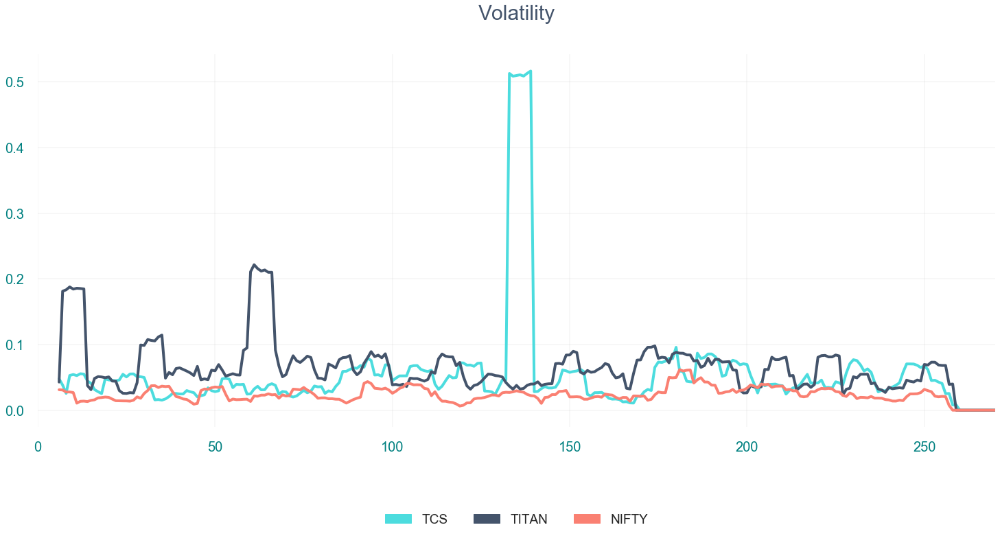
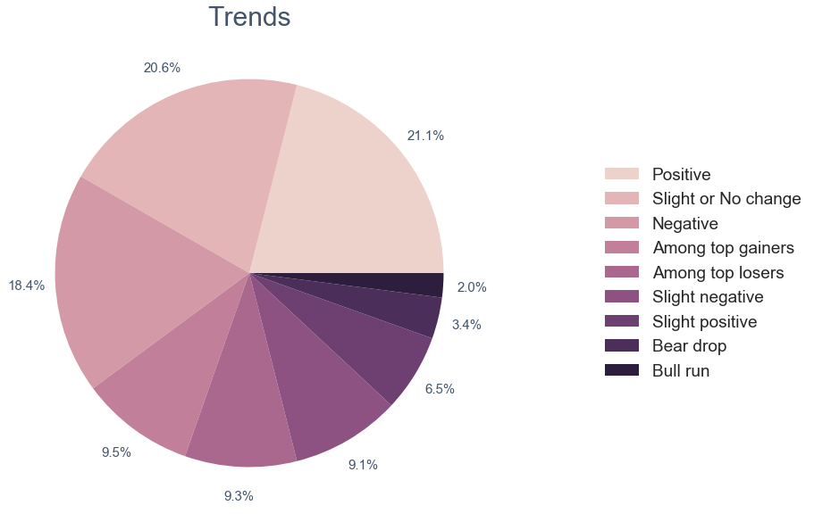

# Stock market analysis

### Table of Contents

- [Project Motivation](#motivation)
- [Screenshots](#screenshots) 
- [Contribute](#contribute)
- [Acknowledgement](#ack)


<a id='motivation'></a>

## Project Motivation

Ah, the mystical world of stock markets... it has always intrigued me. This project is my sincere attempt to de-mystify it in a data-driven and visual way that is easy on the eyes and the mind, but still retains all the core concepts.

***

<a name="screenshots"/>

## Screenshots






***

<a name="contribute"/>

## Contribute
1.  Fork the repository from Github
2.  Clone your fork

`git clone https://github.com/kaustubh-ai/DHFL-stock-market.git`

3.  Add the main repository as a remote

```git remote add upstream https://github.com/kaustubh-ai/DHFL-stock-market.git```

4.  Create a pull request!

***

<a name="ack"/>

## Acknowledgement
Thanks to Career Launcher and Intel for providing me with this data and opportunity!
